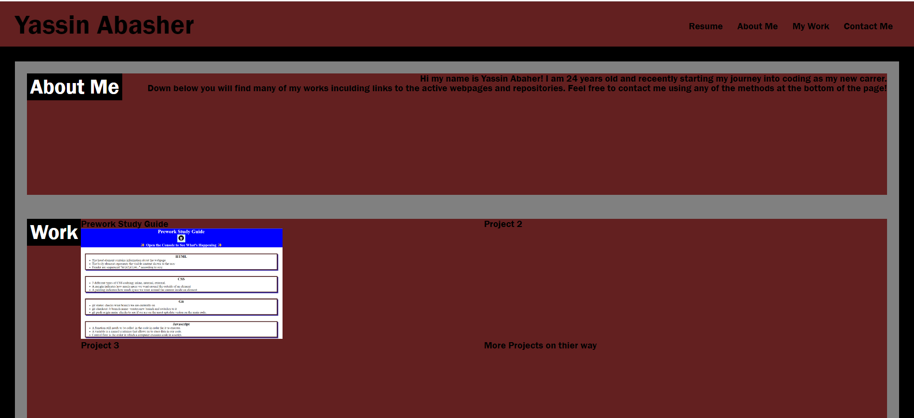

# portfolio
# <Yassin Abasher Portfolio>

## Description
 
This project was started in order to create an interactive coding portfolio for Yassin Abasher. The live website was built from scratch and is intended to display the various works of Yassin Abasher to potential employers and fellow coders. This website can be used as a cover letter or a resume to streamline the process for employers to view and contact Yassin Abasher. While working on this project many advanced CSS fundamentals were used to create a fun and interactive website. 

## Installation

This website can be viewed on a live webpage browser following this link : https://abasheryassin.github.io/portfolio/

## Usage

Down Below is a screen shot of the live website.

## License

This repository uses MIT Licenses.

## Features

Links to all of the live websites of Yassin Abashers projects.
Interactive webpage changes with the size of the display.
